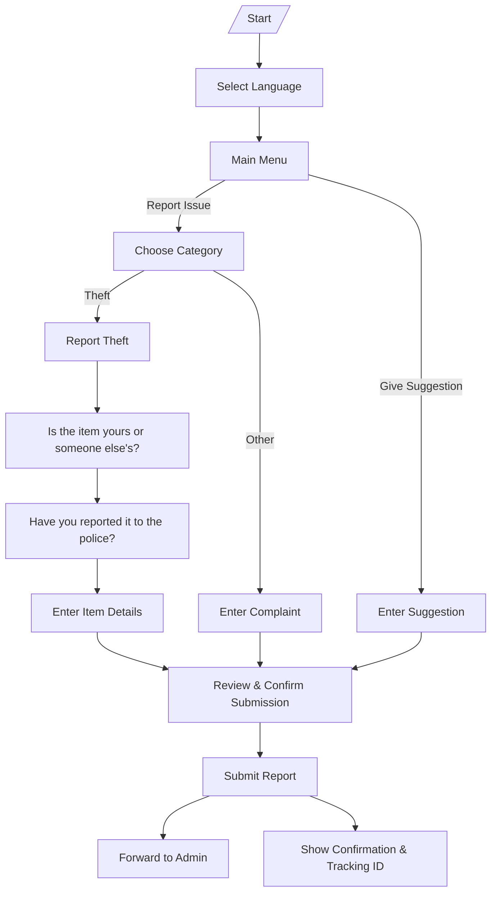

# Hawassa University Student Union Telegram Bot


[](https://opensource.org/licenses/MIT)
[](https://www.python.org/)
[](https://telegram.org/)

This is a Telegram bot designed for the Hawassa University Student Union (HUSU) to facilitate student feedback, complaints, and suggestions. The bot allows students to report issues across various categories (e.g., cafe, dorm, academic, theft) in a secure and multilingual manner. It supports English, Amharic, Afaan Oromoo, and Sidaamu Afoo languages, ensuring accessibility for diverse users. Reports are forwarded to designated admin chat groups for review and action.

The bot emphasizes user privacy, multilingual support, and specialized handling for sensitive issues like theft reports, including follow-up contact details.

## Features

- **Multilingual Support**: Users can select from English, Amharic, Afaan Oromoo, or Sidaamu Afoo.
- **Complaint Categories**: 
  - Cafe 🍽️
  - Dorm 🏠
  - Academic 📚
  - Cleaning 🧹
  - Repair & Maintenance 🔧
  - Clinic 🏥
  - Theft Reporting 🚨 (with detailed steps for ownership, location, and police reporting)
- **Suggestions**: Open-text field for general feedback or ideas.
- **Theft-Specific Workflow**: Guides users through reporting stolen items, including owner details, location (dorm, library, other), date/time, and police reporting status.
- **Admin Forwarding**: Messages are sent to specific admin chat threads based on category and language.
- **Validation**: Prevents links in messages and handles group chats gracefully.
- **Error Handling**: Logs exceptions and provides user-friendly error messages.
- **Commands**:
  - `/start`: Initializes the bot and shows the language/main menu.
  - `/language`: Allows changing the language.

## Bot Workflow



## Prerequisites

- Python 3.8+
- A Telegram Bot Token (create one via [BotFather](https://t.me/botfather)).
- Telegram chat IDs for admins (e.g., for forwarding complaints).
- Environment variables configured in a `.env` file.

## Installation

1. Clone the repository:
   ```
   git clone https://github.com/yourusername/hawassa-university-student-union-bot.git
   cd hawassa-university-student-union-bot
   ```

2. Install dependencies:
   ```
   pip install -r requirements.txt
   ```

3. Create a `.env` file in the root directory with the following variables:
   ```
   BOT_TOKEN=your_telegram_bot_token
   ADMIN_CHAT_ID=admin_chat_id_for_english_amharic
   SIDAMA_OROMO_ADMIN_CHAT_ID=admin_chat_id_for_sidama_oromo
   CAFE_THREAD_ID=thread_id_for_cafe_complaints
   DORM_THREAD_ID=thread_id_for_dorm_complaints
   ACADEMIC_THREAD_ID=thread_id_for_academic_complaints
   CLEANING_THREAD_ID=thread_id_for_cleaning_complaints
   REPAIR_THREAD_ID=thread_id_for_repair_complaints
   CLINIC_THREAD_ID=thread_id_for_clinic_complaints
   THEFT_THREAD_ID=thread_id_for_theft_reports
   SUGGESTIONS_THREAD_ID=thread_id_for_suggestions
   SIDAMA_OROMO_CAFE_THREAD_ID=thread_id_for_sidama_oromo_cafe
   # ... (add similar for other categories in Sidama/Oromo)
   ```
   - Replace values accordingly. Thread IDs are for message threads in group chats.

## Usage

1. Run the bot:
   ```
   python HUSCTelegramBot.py
   ```
   The bot will start polling for updates and log "Polling..." to the console.

2. Interact with the bot on Telegram:
   - Search for your bot's username.
   - Use `/start` to begin.
   - Select a language, then choose "Complaint" or "Suggestion".
   - Follow the prompts for detailed reporting.

##
## Project Structure

- `HUSCTelegramBot.py`: Main entry point; sets up the bot application and handlers.
- `buttonHandler.py`: Handles inline button callbacks (e.g., language selection, complaint categories).
- `messageHandler.py`: Processes text messages, validates input, and forwards to admins.
- `handleTheftComplaint.py`: Specialized logic for theft reports, including multi-step workflows.
- `mainMenu.py`: Displays the main menu and language selection.
- `requirements.txt`: List of Python dependencies.
- `LICENSE`: MIT License details.
- `.env`: Configuration file (not tracked in Git).

## Dependencies

The bot uses the following libraries (as listed in `requirements.txt`):
- `python-telegram-bot`: For interacting with the Telegram API.
- `python-dotenv`: For loading environment variables.
- Other utilities: `anyio`, `certifi`, `h11`, `httpcore`, `httpx`, `idna`, `sniffio`, `typing_extensions`.

## Contributing

Contributions are welcome! Please follow these steps:
1. Fork the repository.
2. Create a feature branch (`git checkout -b feature/YourFeature`).
3. Commit your changes (`git commit -m 'Add YourFeature'`).
4. Push to the branch (`git push origin feature/YourFeature`).
5. Open a Pull Request.

Ensure code follows Python best practices and includes relevant tests.

## License

This project is licensed under the MIT License. See the [LICENSE](LICENSE) file for details.

## Contact

For questions or support, contact the developer:
- Yonatan Berihun (copyright holder)
- GitHub Issues: [Open an issue](https://github.com/yourusername/hawassa-university-student-union-bot/issues)

Thank you for using the Hawassa University Student Union Bot! 🚀


